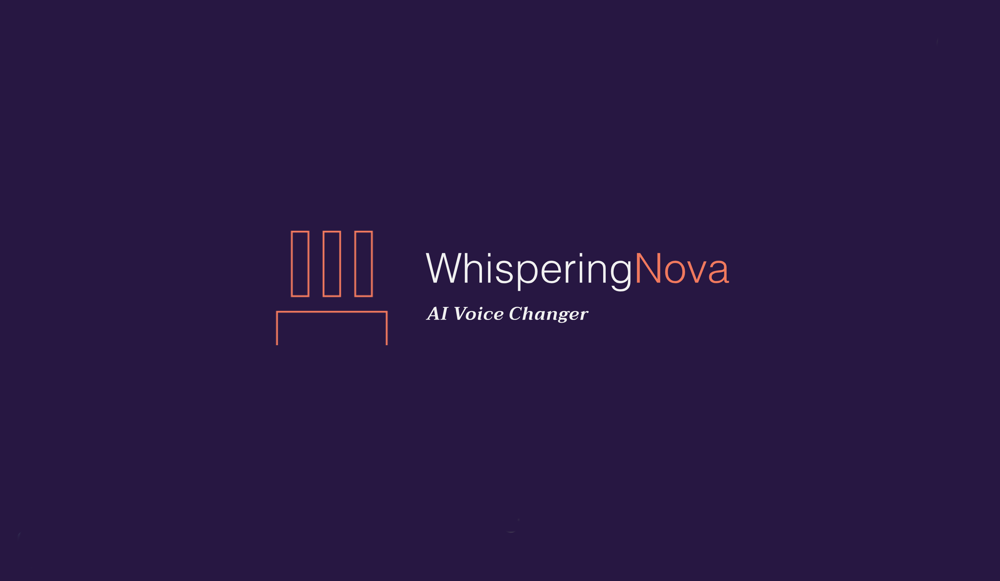

# WhisperingNova v1.0
An AI voice changer harnessing the power of OpenAI and VoiceVox for seamless voice transformation.

## Purpose
WhisperingNova is an extraordinary project that aims to revolutionize voice modulation. It offers a unique and immersive experience by enabling users to effortlessly transform their voices into captivating anime-style renditions

## Technologies Used
- Python    (Programming Language)
- Docker    (Container Service)
- Whisper AI    (SPEECH to TEXT Engine)
- deepL  (Translates English Text to Japanese Text)
- VoiceVox  (TEXT to SPEECH Engine) (For Japanese Output)
- Markdown  (Web Markup Language)
- Git   (Version Control System)

## Applicability
WhisperingNova falls under the category of Entertainment/Arts, offering a unique and immersive voice transformation experience. Whether you are an aspiring VTuber, an anime enthusiast, or a gamer. WhisperingNova usage is simply a Voice Tranformation Service under fair usage.

## How to install
Read the [Installation Guide](https://github.com/NONAN23x/WhisperingNova/releases) section

## How it works
[Read here](https://github.com/NONAN23x/WhisperingNova/wiki/How-does-it-work%3F)

## Bugs and Issues
Please report your findings at [issues](https://github.com/NONAN23x/WhisperingNova/issues)
